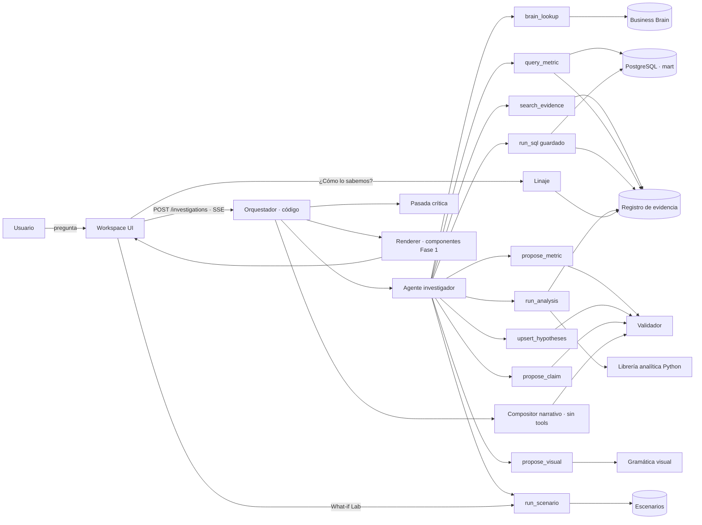

# Finora · Propuesta de arquitectura v1
## Del Exploration Workspace a un Business Analytics Agentic Workspace

> Documento para discusión. No incluye implementación.
> Punto de partida: el workspace de la Fase 1 (`finora_eda.html`) y su pipeline reproducible (`finora_eda.py`).
> Idioma: toda la experiencia de usuario en español; código, esquemas y nombres internos en inglés.
> Versión 1.2 · 27-sep-2026. v1.1 agrega la escalera de libertad del agente (§3.3). v1.2 agrega el modelo de ingreso en tres capas (§10) y el Scenario Engine (§11).
> **Estado: CONGELADA (v1.2).** No se agregan features. Orden de ejecución: primero las modificaciones de la Fase 1 (§14), después una sola vertical slice agentic de punta a punta (§12, pregunta dorada 2).

---

## 0. En una página

**Principio del producto.** Un analista senior investiga tu pregunta y construye frente a ti el argumento ejecutivo. La IA decide *qué mirar*; el código decide *cuánto vale*; la narrativa solo puede usar lo que ya fue validado.

| Decisión | Recomendación |
|---|---|
| Número de agentes | **Uno**: el agente investigador. |
| Narrativa ejecutiva | **Compositor restringido**: llamada LLM sin tools ni loop, con salida estructurada. No es agente. |
| Revisor / crítico | **Validación determinista** en código + **una pasada crítica** con rúbrica. No es agente. |
| Cálculo, SQL, estadística, gráficas, linaje | **Tools y código deterministas.** El LLM nunca calcula ni escribe cifras libres. |
| Libertad del agente | **Amplia para explorar**: parametriza métricas (YoY, cortes, periodos), combina vistas y propone métricas nuevas. **Nula para afirmar sin evidencia** o redefinir métricas en silencio (§3.3). |
| Modelo de ingreso | **Tres capas, una identidad**: negocio subyacente, realización comercial y cobro. Hoy solo observamos lo pagado, que mezcla las tres (§10). |
| Escenarios | **Motor determinista** sobre identidades contables, con compuerta de admisibilidad. Lo simulado nunca se mezcla con lo observado, y el sistema sabe cuándo no simular (§11). |
| Experiencia | Cada pregunta genera un **documento de investigación** con los mismos componentes del workspace. El workspace no se deforma. |
| Confianza | **Cinco estados epistémicos con reglas en código.** Sin porcentajes de confianza. |
| Lente de audiencia | Sí, como **lente de comunicación** con tres opciones. "Analista" deja de ser lente: pasa a ser "¿Cómo lo sabemos?", disponible en todo bloque. SHOULD HAVE. |
| Datos | PostgreSQL mínimo (raw → staging → mart + app) con **paridad exacta** contra la Fase 1. |
| Demo | **Investigaciones doradas pre-generadas** más modo en vivo. |
| MECE | Taxonomía anclada en la **identidad del puente de MRR**. Calidad del dato e industria pasan a ser capas transversales, no dominios. |

**El riesgo principal no es técnico.** Es que la capa agentic opaque el análisis de los casos CRO y CFO. Quien evalúe el challenge va a juzgar primero la calidad del razonamiento. Todo lo que sigue está dimensionado para que la IA *exponga* ese razonamiento, no para reemplazarlo.

---

## 1. Qué cuestiono y qué recorto

| Idea inicial | Recomendación | Por qué |
|---|---|---|
| Executive Narrative Agent separado | Compositor restringido (skill) | La restricción que propones (sin acceso a datos, solo claims validados) es justo lo que lo vuelve *no* agente: no tiene nada que decidir sobre qué mirar. Es una transformación con esquema. Darle loop y tools reabre el riesgo que querías cerrar. |
| Analytics Reviewer como agente | Validador en código + pasada crítica | La mayor parte de lo que revisaría son reglas verificables: cifras ligadas a evidencia, lenguaje causal, ventanas válidas, estados coherentes. Lo sutil (sobre-afirmación, alternativas omitidas) cabe en una revisión con rúbrica. |
| SQL tool como herramienta central | Capa semántica primero; SQL con guardas cuando no alcanza | "Auto-SQL" no diferencia y es el principal vector de error. La mayoría de las preguntas se resuelven parametrizando el catálogo; cuando no alcanza, el agente sí escribe SQL, con guardas y etiquetado (§3.3). |
| Reconfigurar dinámicamente el dashboard | Documento de investigación que reutiliza bloques | Mutar el workspace desorienta: el usuario pierde su mapa. Es mejor una vista nueva, construida con los mismos componentes, que enlace de regreso a las secciones de origen. |
| Cuatro audiencias (CEO, CRO, CFO, Analista) | Tres lentes + "¿Cómo lo sabemos?" | Analista no es una audiencia, es un nivel de detalle. La divulgación progresiva lo resuelve para todos. |
| Scores de confianza | Cinco estados con reglas | Un "92%" sin modelo detrás es ruido. Los estados se asignan por reglas explícitas y auditables. |
| Todo en vivo | Investigaciones doradas + modo en vivo | Una investigación nueva tarda del orden de 1 a 3 minutos. En una presentación eso es eterno y frágil. |
| Situación → Hallazgo → Implicación → Decisión → Acción, literal | Decisiones condicionales y acciones de validación | Sin identificación causal, "hacer X porque causa Y" está prohibido. Las acciones son validar, pedir datos o experimentar. |
| Migrar el front a un framework | Mantener JS sin framework + la librería de gráficas actual | Funciona y se ve bien. Una reescritura es riesgo puro. Basta un router y un renderer de narrativas. |
| Un motor de escenarios genérico | Pocas identidades registradas + registro de drivers | Un motor de modelado general termina siendo un pronosticador disfrazado. Se generaliza agregando drivers, no complejidad. |
| Escenarios de descuentos con los datos actuales | Diagnóstico + solicitud de campos + DEMO etiquetado | Los campos no existen; inventarlos contaminaría todo el análisis. |
| Supuestos de escenario como casillas | Supuestos fijos por tipo; "respuesta de clientes" deshabilitada hasta tener evidencia | Desmarcar un supuesto no puede producir un número: exige un modelo. |

---

## 2. Agent map

**Definiciones que uso en todo el documento**

- **Agente**: LLM en un loop que elige herramientas y decide cuándo parar según resultados intermedios.
- **Skill**: llamada LLM acotada (sin tools, sin loop, salida con esquema) seguida de validación en código.
- **Tool**: función determinista con esquema estricto que el agente puede invocar.
- **Código**: software normal, sin LLM.

| Componente | Tipo | Responsabilidad | Por qué este tipo |
|---|---|---|---|
| Exploration Workspace (Fase 1) | Código | Vista base del negocio, navegable sin IA | Determinista y ya validado |
| Modelos analíticos SQL | Código | `customer_month`, métricas mensuales, cohortes, puente, S&M | Un cálculo debe dar siempre lo mismo |
| Capa semántica (catálogo de métricas) | Código + datos | Definición → SQL compilado → linaje | Evita SQL libre para lo común |
| Business Brain | Datos versionados | Contexto, frameworks, guardrails, playbooks, hallazgos conocidos | Es conocimiento, no comportamiento |
| Orquestador de investigación | Código | Máquina de estados, presupuestos, reintentos, streaming | El flujo es conocido; debe ser predecible |
| **Agente investigador** | **Agente** | Interpretar la pregunta, construir el árbol de hipótesis, elegir análisis, evaluar evidencia, proponer claims, decidir cuándo hay suficiente evidencia | El camino depende de lo que va apareciendo. Es el único lugar con decisiones abiertas. |
| Selección de playbook | Primer paso del agente | Mapear la pregunta a una familia conocida | No justifica un rol propio |
| `brain_lookup` | Tool | Recuperar definiciones, frameworks, guardrails, playbooks | Lectura determinista |
| `query_metric` | Tool | Consultar métricas del catálogo | Determinista y con linaje |
| `run_sql` | Tool guardada | Combinar vistas o crear nuevas cuando el catálogo no alcanza | Libertad con guardas |
| `run_analysis` | Tool | Descomposición, rezagos, cohortes, bootstrap, distribuciones, escalones | El LLM no debe hacer estadística |
| Registro de evidencia | Código + `search_evidence` | Guardar cada resultado con su consulta y linaje; reutilizarlo | Auditoría e inmutabilidad |
| `upsert_hypotheses`, `propose_claim`, `propose_visual`, `propose_metric` | Tools de registro validado | El agente propone; el código acepta o rechaza con motivos | Separa juicio (LLM) de verificación (código) |
| Validador (guardrails) | Código | Cifras ligadas, estado epistémico, lenguaje causal, ventanas válidas, datos faltantes, cobertura MECE | Reglas explícitas; el LLM no se auto-valida |
| Gramática visual | Código | Intención + forma de los datos → tipo de gráfica; título = claim validado | Consistencia visual, cero improvisación |
| Modelo de ingreso en tres capas | Código | Derivar capas y puentes (subyacente, comercial, cobro) desde eventos | Es contabilidad: debe cuadrar siempre |
| `run_scenario` (Scenario Engine) | Tool determinista | Ejecutar escenarios admisibles y devolver resultado + traza | El LLM no debe hacer aritmética de escenarios |
| Registro de drivers | Datos versionados | Operaciones permitidas, rangos, datos requeridos, tipos de escenario | La admisibilidad es regla, no juicio |
| What-if Lab | Código (UI) | Formulario que llama directo al motor | No necesita LLM |
| **Compositor narrativo** | **Skill** | Respuesta ejecutiva, jerarquía, orden, implicaciones, próximas preguntas, narrativa ejecutiva | Transformación con esquema, sin acceso a datos |
| Pasada crítica | Skill | Sobre-afirmación, causalidad implícita, alternativas omitidas, coherencia | Una revisión con rúbrica basta |
| Lente de audiencia | Parámetro del compositor | Orden, profundidad, implicaciones | No cambia hechos: no es filtro ni agente |
| Servicio de linaje | Código | Claim → evidencia → método → consulta → fuente | Navegación determinista |
| Renderer | Código | Narrativa JSON → componentes del workspace | Misma calidad visual que la Fase 1 |
| Evals | Código + dataset | Preguntas doradas, cobertura de hipótesis, afirmaciones prohibidas | Calidad medible y sin regresiones |

---

## 3. Arquitectura de agentes recomendada

### 3.1 Cuántos agentes: uno

El único trabajo que no se puede especificar de antemano es convertir una pregunta de negocio ambigua en una investigación, y ajustarla según lo que va apareciendo. Eso es el agente investigador.

Lo demás cae en dos grupos:

- **Transformaciones con estructura conocida** (narrativa, crítica). Son skills.
- **Cálculos y verificaciones** (métricas, SQL, estadística, visualización, validación, linaje). Son tools o código.

Aplicando los cuatro criterios para decidir si algo merece ser agente:

| Criterio | Investigación | Narrativa | Revisión |
|---|---|---|---|
| Complejidad: ¿varios pasos difíciles de especificar de antemano? | Sí | No: estructura fija | No: rúbrica fija |
| Valor que justifica costo y latencia | Sí | No hace falta loop | No hace falta loop |
| Viabilidad | Sí | Sí | Sí |
| Errores detectables y recuperables | Sí, con validadores y linaje | — | — |

### 3.2 Qué hace el agente investigador

**Entrada:** la pregunta, la lente, el contexto del hilo (resumen de claims y evidencias ya existentes) y el núcleo del Business Brain.

**Loop:**

1. **Encuadrar.** Reformula la pregunta como pregunta analítica verificable. Identifica métricas, periodo y segmentos. Elige un playbook, o arma el árbol desde un framework.
2. **Pre-registrar.** Registra con `upsert_hypotheses` un árbol MECE. Para cada hipótesis anota la *firma esperada* (qué veríamos si fuera cierta y qué si fuera falsa) **antes** de mirar resultados.
3. **Reunir evidencia.** Primero `search_evidence` (evidencia canónica de la Fase 1 y de investigaciones previas). Luego `query_metric` y `run_analysis`. `run_sql` solo si nada de lo anterior sirve. Si las llamadas son independientes, van en paralelo.
4. **Evaluar.** Contrasta resultados contra las firmas. Propone claims (`propose_claim`) y visuales (`propose_visual`), y corrige lo que el validador rechace. Si la pregunta pide un escenario, arma la especificación y llama a `run_scenario` (§11).
5. **Cerrar.** Toda hipótesis termina en estado terminal, o marcada como "no evaluada por presupuesto". Entrega el *paquete de investigación*.

**Lo que el agente no hace:** redactar la narrativa final, escribir cifras a mano (toda cifra sale de una tool), redefinir en silencio una métrica existente (por ejemplo, cambiar qué cuenta como churn sin declararlo), ni fijar estados epistémicos por su cuenta (los propone; el validador los confirma o los degrada). Tampoco calcula escenarios ni decide si uno es admisible: eso lo hace el motor (§11).

**Lo que sí hace, y es la razón de que sea agente:** ir más allá de las vistas que definimos (§3.3).

### 3.3 Cuánta libertad tiene el agente: la escalera

Las vistas que definimos (marts y catálogo) son el punto de partida, no el límite. Cuando una pregunta no cabe en ellas, el agente sube de nivel. Cada nivel da más libertad y trae más verificación.

| Nivel | Qué hace el agente | Ejemplo en Finora | Tool | Cómo se verifica | Techo de estado |
|---|---|---|---|---|---|
| 1 · Reutilizar | Usa evidencia que ya existe | "¿Cuánto cayó el ticket?" → claim canónico de la Fase 1 | `search_evidence` | Ya verificada | El de la evidencia |
| 2 · Parametrizar | Cambia grano, periodo, filtros, cortes o comparación (YoY, MoM, contra otro periodo, índice) sobre métricas del catálogo | "¿Cómo se ve YoY el MRR?" → oct-24 vs oct-23: MRR +35%, clientes activos +48% | `query_metric` | El sistema compila el SQL y aplica solo las ventanas y reglas de cada métrica | Hecho observado |
| 3 · Combinar o crear una vista | Escribe SQL que cruza marts o arma una vista nueva | "¿Los clientes que entraron con ticket bajo se van más?" → altas por banda de ticket × activos al M6 | `run_sql` | Solo lectura; reconciliación contra totales conocidos; SQL visible en *¿Cómo lo sabemos?* | Direccional hasta reconciliar; después Hecho observado con marcador *Cálculo ad hoc* |
| 4 · Proponer una métrica nueva | Declara definición, fórmula, grano y SQL de algo que no existe | "Tasa de pausa": churns que vuelven en ≤ 2 meses ÷ churns | `propose_metric` | El validador revisa definición y SQL; marcador *Métrica propuesta* | Igual que el nivel 3; entra al catálogo solo con revisión humana |

**Por qué hay guardas aunque la pregunta sea simple.** El YoY de altas de feb-23 contra feb-22 da −72%, y es falso: feb-22 está inflado por el arrastre de clientes que ya existían. En el nivel 2, la métrica `new_customers` sabe que su ventana válida empieza en mar-22 y marca esa comparación como *no comparable*. Con SQL libre y sin reglas, el agente habría publicado ese −72%. La mayoría de los errores analíticos no son de aritmética: son de definición y de ventana.

**La regla de fondo:** libertad amplia para *explorar*; ninguna para *afirmar* sin evidencia o *redefinir* en silencio.

**Límites del MVP**

- La estadística (descomposiciones, correlaciones, bootstrap) sigue siendo un catálogo cerrado de métodos parametrizables, porque un método mal elegido es más difícil de auditar que un SQL. El análisis ad hoc en Python dentro de un sandbox, con el mismo etiquetado, queda como FUTURE.
- Datos externos (inflación, benchmarks de la industria) se pueden agregar como tool, siempre con la fuente citada y sin mezclarse en silencio con los datos internos. También FUTURE.

### 3.4 Cómo se comunican las piezas

No hay conversación entre agentes. Hay **objetos tipados en el estado de la investigación**.

- El compositor recibe un *brief*: pregunta, lente, claims validados, hipótesis con estado, límites e IDs de visuales. **Nunca recibe el transcript del agente.** Así, el razonamiento no validado no puede filtrarse a la historia.



**Máquina de estados de una investigación**

`encuadre → hipótesis → evidencia → validación → composición → revisión → publicada`, más `seguimiento`, que vuelve a `hipótesis` dentro del mismo hilo.

**Política ante observaciones de la pasada crítica** (acotada):

1. Degradar el estado del claim afectado.
2. Recomponer una vez con las observaciones.
3. Solo si el problema está en la evidencia, devolver al agente una vez.

### 3.5 Modelo e infraestructura LLM

- **Modelo:** `claude-opus-5` para los tres roles (agente, compositor, crítico), variando `effort` (alto, medio, bajo). Un solo modelo significa un solo espacio de caché y menos variables. Mover compositor y crítico a un modelo más barato es una decisión tuya, posterior y medida con evals.
- **Harness:** Claude API con el **Tool Runner** del SDK de Python, dentro de un backend FastAPI. Nosotros hospedamos los datos y las tools. Los hooks por turno sirven para registrar evidencia, aplicar presupuestos y emitir streaming.
  - **Managed Agents** no aporta aquí: las tools viven junto a Postgres y el estado vive en nuestra base. Agregaría una plataforma sin resolver nada que el Tool Runner no resuelva.
  - **Claude Agent SDK** no aplica: es un harness orientado a código y archivos.
- **Contratos:** tools con `strict: true`, para que los inputs siempre validen contra el esquema. El compositor usa salidas estructuradas (`output_config.format`).
- **Prompt caching:** prefijo estable (tools → system con el núcleo del cerebro, ordenado y sin timestamps) marcado con `cache_control`. Se verifica con `cache_read_input_tokens`.
- **Streaming** (SSE) hacia la UI: encuadre, hipótesis, evidencias y bloques aparecen a medida que existen.
- **Presupuestos:** tope de llamadas a tools por investigación (orden de 12 a 15). Opcionalmente, *task budgets* (beta) para que el agente se dosifique.
- **Robustez:** el orquestador maneja todos los `stop_reason`, incluido `refusal`.

### 3.6 Cuándo sí agregaría un segundo agente

- **Monitoreo programado** (futuro). Un agente que corre periódicamente y detecta cambios relevantes. Tiene otro disparador y otra responsabilidad, así que ahí sí se justifica.
- **Sub-investigaciones independientes y pesadas en lectura.** Serían copias del mismo agente (subagentes), no un rol nuevo. Hoy las llamadas paralelas bastan.

Ninguno de los dos entra en el MVP.

---

## 4. Arquitectura de tools

| Tool | Qué hace | Entrada | Salida | Guardas |
|---|---|---|---|---|
| `brain_lookup` | Recupera fragmentos del cerebro por ID o tema | `ids` o `topic` | Fragmentos con ID y versión | Solo lectura; tamaño acotado |
| `query_metric` | Compila una métrica del catálogo a SQL y la ejecuta | `metric_id`, `grain`, `period`, `filters`, `group_by`, `compare` (YoY, MoM, contra otro periodo, índice) | Tabla compacta + `evidence_id` + linaje + caveats | Solo métricas del catálogo; ventana limpia aplicada automáticamente; dimensiones válidas; comparaciones fuera de la ventana válida marcadas como no comparables |
| `run_sql` | Combina vistas o crea una nueva con SQL de solo lectura | `sql`, `purpose` | Tabla (≤ 200 filas) + `evidence_id` | Rol de solo lectura, esquemas permitidos, parseo y lint previos, timeout, límite de filas; reconciliación contra totales conocidos; marcador *Cálculo ad hoc* |
| `propose_metric` | Declara una métrica nueva para usarla en la investigación | Nombre, definición, fórmula, grano, SQL | `metric_id` provisional + `evidence_id` | Validador de definición y SQL; marcador *Métrica propuesta*; entra al catálogo solo con revisión humana |
| `run_analysis` | Ejecuta un análisis del catálogo cerrado | `analysis_id`, `params` | Resultado + método + supuestos + robustez + `evidence_id` | Parámetros validados; solo análisis registrados |
| `search_evidence` | Encuentra evidencia reutilizable (canónica o del hilo) | Métrica, dimensiones, periodo o texto | Evidencias resumidas con ID | — |
| `upsert_hypotheses` | Registra el árbol y actualiza estados | Árbol con firmas esperadas | OK o errores | Firma obligatoria; cobertura MECE contra la identidad del framework |
| `propose_claim` | Crea una afirmación ligada a evidencia | Plantilla, variables, tipo, estado propuesto, evidencias a favor y en contra, alcance, caveats | Aceptado o rechazado + motivos + estado permitido | Validador completo (§5.4) |
| `propose_visual` | Pide la visualización de un claim | `claim_id`, intención, `evidence_id` | Especificación de gráfica según la gramática | Título = claim validado; tipo decidido por reglas |
| `run_scenario` | Ejecuta un escenario admisible sobre identidades registradas | Especificación del escenario (§11.6) | Resultado + traza + limitaciones, o "no disponible" con motivo y qué haría falta | Compuerta de admisibilidad; registro de drivers; rangos; horizonte máximo; sello SIMULADO |

**Catálogo cerrado de `run_analysis`** (casi todo existe ya en `finora_eda.py`)

- `mix_within_decomposition`: Shapley, bootstrap y variantes.
- `lag_correlation`: niveles y cambios mes a mes, Pearson y Spearman, n y p.
- `cohort_curves`: logos, ingreso y MRR por cliente original; mensual y trimestral.
- `mrr_bridge`: por periodo y segmento.
- `ticket_distribution`: percentiles, bandas de precio y comparación entre periodos.
- `vintage_arpa`: MRR por cliente por cosecha.
- `movement_transience`: retornos y reversiones.
- `segment_compare`: métrica por segmento y periodo, con intervalo bootstrap.
- `step_change`: escalón y fecha, con regla explícita.
- `churn_selection` (**nuevo**): ticket de quienes se van contra quienes se quedan.

**Principios de diseño**

1. Toda tool que calcula registra evidencia automáticamente. El agente nunca "escribe" evidencia.
2. Las tools devuelven resúmenes compactos, no tablas gigantes. El detalle queda en el registro.
3. Los errores son tipados y traen pista de corrección.
4. Ninguna tool acepta cifras escritas por el agente como dato.

**Gramática visual** (reglas deterministas; intención → forma)

| Intención | Forma |
|---|---|
| Tendencia de una métrica | Línea, con banda si hay distribución |
| Crecimientos en unidades distintas | Índice base 100 en un solo eje |
| Composición en el tiempo | Barras apiladas al 100% |
| Descomposición aditiva o puente | Cascada |
| Entradas y salidas | Barras divergentes + línea neta |
| Relación entre dos variables | Dispersión + recta de lectura + estadístico |
| Retención | Mapa de calor + curvas |
| Distribución | Bandas o histograma |
| Segmentos en 2–3 periodos | Puntos conectados |
| Una cifra | Tarjeta KPI |
| Detalle | Tabla anotada |

---

## 5. Modelo de estado

### 5.1 Relaciones

```
Question ──< Investigation (hilo) ──< Hypothesis (árbol) >──< Claim >──< Evidence ── Query/Analysis ── Source
                                                              │
                                                              └── Visual
Narrative ──< Block >──< Claim            (una narrativa nunca referencia Evidence ni datos directamente)
Scenario >── Driver · insumos ──> Evidence   (el resultado de un escenario nunca es Evidence)
```

### 5.2 Entidades

| Entidad | Campos clave |
|---|---|
| **Question** | `id`, `text`, `lens`, `parent_investigation_id`, `resolved_entities` (métricas, periodo, segmentos), `playbook_id`, `created_at` |
| **Investigation** | `id`, `root_question_id`, `thread` (preguntas en orden), `status` (máquina de estados), `hypothesis_tree`, `executive_answer_claim_id`, `data_version`, `brain_version`, `budget_used` |
| **Hypothesis** | `id`, `parent_id`, `question_es` (formulada como pregunta), `framework_node` (componente de la identidad que cubre), `expected_signature` (a favor / en contra), `status`, `claim_ids`, `rationale` |
| **Evidence** (inmutable) | `id`, `kind` (métrica, SQL, análisis, auditoría), `tool`, `params`, `query_text`, `result_ref`, `result_hash`, `metric_ids`, `dims`, `period`, `n`, `method`, `assumptions`, `robustness`, `caveat_ids`, `data_version`, `canonical` |
| **Claim** | `id`, `template_es` (con variables), `bindings` (variable → evidencia.campo), `type` (descriptivo, comparativo, asociativo, descomposición), `epistemic_status`, `supporting_ids`, `contradicting_ids`, `scope`, `caveat_ids`, `hypothesis_ids`, `validation` |
| **Visual** | `id`, `claim_id`, `intent`, `chart_type`, `evidence_id`, `encoding`, `annotations`, `table_view` |
| **Narrative** | `id`, `investigation_id`, `lens`, `mode` (investigación o narrativa ejecutiva), `blocks` (ordenados, cada uno con `claim_ids`), `implications`, `next_questions`, `version`, `review` |
| **Caveat** | `id`, `text_es`, `applies_to` (métricas, periodos), `severity`, `source` (guardrail del cerebro) |
| **Scenario** | `id`, `type` (contrafactual mecánico, intervención mecánica, proyección condicionada), `spec` (§11.6), `admissibility`, `result`, `calculation_trace`, `input_evidence_ids`, `dataset` (finora o demo), `origin` = simulado |
| **Driver** | `id`, `definition_es`, `unit`, `source_metric`, `operations`, `valid_range`, `data_tier_required`, `allowed_scenario_types` |

### 5.3 Invariantes (verificadas por código)

1. **Toda cifra visible sale de una evidencia.** Los textos son plantillas con variables ligadas, y el renderer lee el valor de la evidencia al pintar.
2. **Ningún claim sin evidencia, ninguna gráfica sin claim, ningún bloque narrativo sin claim.**
3. **La evidencia es inmutable y recalculable.** Guarda el hash de los datos y la versión del cerebro.
4. **Los estados se derivan por reglas.** El agente propone y el código confirma.
5. **Las hipótesis refutadas y las no evaluables se muestran.** No se esconden para dejar la historia más limpia.
6. **Lo simulado nunca se guarda como evidencia observada** ni se muestra sin su sello. Los datos DEMO nunca comparten vista con datos reales.

Ejemplo:

```json
{
  "claim": {
    "id": "C-ACQ-014",
    "template_es": "El {share_within} de la caída del ticket promedio ocurre dentro de las industrias; el cambio de mix explica {share_mix}.",
    "bindings": {"share_within": "E-0712.within_share", "share_mix": "E-0712.mix_share"},
    "type": "descomposicion",
    "epistemic_status": "evidencia_fuerte",
    "supporting_ids": ["E-0712", "E-0713", "E-0714"],
    "contradicting_ids": [],
    "scope": {"period": "2022(mar–dic) vs 2024(ene–oct)", "segment": "clientes nuevos"},
    "caveat_ids": ["CV-within-no-es-precio", "CV-m0-2022-picos"]
  },
  "evidence": {
    "id": "E-0712",
    "kind": "analysis",
    "tool": "run_analysis",
    "params": {"analysis_id": "mix_within_decomposition", "value": "m0", "periods": ["2022", "2024"]},
    "method": "Shapley (punto medio) + bootstrap 2,000",
    "result": {"within_share": 0.97, "mix_share": 0.03, "within_share_ci90": [0.91, 1.02]},
    "robustness": ["E-0713 (winsorizado P99)", "E-0714 (run-rate temprano)"],
    "data_version": "sha256:2dcbe59e…",
    "canonical": true
  }
}
```

### 5.4 Estados epistémicos: evolución de Observado / Explorando / Precaución

Dos ejes independientes:

**Eje 1 · Estado del claim** (título de cada hallazgo)

| Estado | Regla verificada por código | Ejemplo en Finora |
|---|---|---|
| **Hecho observado** | Valor calculado directamente con una métrica del catálogo en su ventana válida, o con un cálculo ad hoc que pasó reconciliación (con marcador visible); recalculable | Clientes activos 377 → 1,678 |
| **Evidencia fuerte** | Al menos dos evidencias independientes (métodos o variantes) apuntan igual; robustez aprobada; sin evidencia en contra; n suficiente | 97% de la caída del ticket ocurre dentro de las industrias (tres variantes + bootstrap) |
| **Direccional** | Hay señal pero con límites: n pequeño, un solo método, sensibilidad a la definición o asociación temporal. Las correlaciones de esta base nunca pasan de aquí. | Gasto y altas no se asocian positivamente (n ≈ 30, tendencias opuestas) |
| **Hipótesis** | Plausible y consistente con patrones, sin prueba directa | `amount` se comporta como cobro, no como MRR contractual |
| **No evaluable** | Requiere datos del catálogo de faltantes | Conversión del funnel; efecto de precios o descuentos |

**Eje 2 · Marcadores**

- **Explorando**: el bloque se titula con una pregunta porque aún no hay claim.
- **Precaución**: hay un caveat de datos adjunto. Es ortogonal al estado: un hecho observado puede llevar precaución.
- **Cálculo ad hoc** / **Métrica propuesta**: el resultado no viene del catálogo canónico; el SQL está a un clic.

**Eje 3 · Origen**

- **Observado**: viene de los datos históricos.
- **Simulado**: resultado de una intervención hipotética. No puede llevar los estados del eje 1; lleva su tipo de escenario (§11.3).
- **DEMO**: dato sintético para demostrar la experiencia. Marca de agua obligatoria.

**Estado de una hipótesis** (derivado de sus claims)

- **Soportada**: al menos un claim a favor con estado Evidencia fuerte o Hecho observado que responde directamente, y ninguno en contra de nivel Direccional o superior.
- **Direccional**: solo hay apoyo direccional.
- **No soportada**: un claim en contra con estado Evidencia fuerte o superior.
- **No evaluable**: depende de datos faltantes.
- **Pendiente**: no puede quedar así al cerrar; se publica como "no evaluada por presupuesto".

**Reglas del validador** (además de las invariantes de §5.3)

- **Lenguaje causal en español**, detectado por léxico y patrones: *causó, provocó, generó, impulsó, gracias a, debido a, por culpa de*.
  - *Explica* solo se permite en claims de tipo descomposición y con sentido contable ("el mix explica 3% de la caída").
- **Ventanas de tiempo**: los flujos solo se miden en la ventana limpia (mar-22 → oct-24).
- **Incompatibilidades**: S&M nunca se convierte a COP; no se comparan tickets M0 de 2022 sin su caveat.
- **Faltantes**: cualquier hipótesis que requiera funnel, pricing o atribución se marca No evaluable.
- **Tamaño de muestra**: umbrales mínimos por tipo de análisis.
- **Cálculos ad hoc** (SQL o métricas propuestas): marcador visible y estado máximo Direccional hasta pasar la reconciliación.
- **Escenarios**: un claim de tipo escenario solo acepta fraseo condicional ("manteniendo todo lo demás constante…", "sumaría", "liberaría antes de cualquier respuesta de los clientes"). Verbos como *aumentará* o *generará* se rechazan.

---

## 6. Flujo UX

### A · Exploración

Es lo que existe hoy, en español y con resumen MECE (§14). Se agregan tres puntos de entrada:

- **Barra persistente** en el encabezado: *¿Qué quieres entender del negocio?*
- **"Investigar →"** en cada pregunta abierta y en cada bloque *Explorando*. Las preguntas de sección de la Fase 1 se vuelven semillas de investigación.
- **"¿Cómo lo sabemos?"** en cada gráfica: definición, método, consulta y fuente. Es el linaje, disponible desde el día uno.

### B · Preguntar

La barra se expande con el campo de texto, preguntas sugeridas agrupadas por dominio MECE y la lente (inferida y editable).

Al enviar, la vista cambia de inmediato a la investigación. En segundos aparecen el encuadre y el árbol de hipótesis; los bloques se llenan a medida que llega la evidencia. El usuario ve al analista trabajar, no una pantalla de espera.

### C · Investigación

```
┌ Navegación ─────────────┐ ┌──────────────────────────────────────────────────────────────┐
│ ← Workspace             │ │ INVESTIGACIÓN · Lente: Finanzas ▾          [Narrativa ejecutiva] │
│ Investigaciones         │ │ ¿Por qué disminuyó el MRR por cliente?                         │
│  • MRR por cliente      │ │ ┌ Respuesta ejecutiva ────────────────────── Evidencia fuerte ┐ │
│  • Retail y ticket      │ │ │ Bajó 38% por composición: las cosechas 2023–24 pagan menos  │ │
│ ─ Esta investigación ── │ │ │ y ya son 65% de los clientes; los existentes no pagan menos │ │
│  Respuesta              │ │ └─────────────────────────────────────────────────────────────┘ │
│  Cómo la descompusimos  │ │ Cómo descompusimos la pregunta                                 │
│  Hallazgo 1 · 2 · 3     │ │  H1 ¿Entran más baratos los clientes nuevos? ...... Soportada   │
│  Lo que no concluimos   │ │   H1.1 ¿Por cambio de mix de industrias? ....... No soportada   │
│  Implicaciones          │ │   H1.2 ¿Por precios o descuentos? .............. No evaluable   │
│  Próximas preguntas     │ │  H2 ¿Los clientes existentes pagan menos? ...... No soportada   │
│  Registro de análisis   │ │  H3 ¿Se van los de mayor ticket? ............... Pendiente →    │
│                         │ │ ── Hallazgo 1 · ¿Entran más baratos los clientes nuevos? ──     │
│                         │ │  [título = claim] · evidencias · [gráfica] · implicación · ¿Por qué? │
│                         │ │  …                                                             │
│                         │ │ [ Profundizar: ¿Eso se explica por Retail? ……………… ⏎ ]          │
└─────────────────────────┘ └──────────────────────────────────────────────────────────────┘
```

**Estructura del documento de investigación**

1. **Respuesta ejecutiva**, con su estado.
2. **Cómo descompusimos la pregunta.** Árbol MECE: cada hipótesis formulada como pregunta, con su estado y la firma esperada.
3. **Hallazgos.** Cada uno sigue la misma secuencia:
   - pregunta-subtítulo
   - título = claim
   - dos o tres evidencias
   - gráfica
   - interpretación
   - implicación
   - "¿Por qué?"
4. **Lo que no podemos concluir.** Solo los límites que aplican a esta pregunta.
5. **Implicaciones.** Siempre condicionales y citando claims.
6. **Próximas preguntas**, clicables.
7. **Registro de análisis.** Todo lo que se ejecutó, incluido lo descartado. Es una defensa contra el cherry-picking.
8. **Simulaciones**, si la pregunta las pide: separadas del análisis observado y selladas (§11.8).

**Bajar desde cualquier conclusión**

`claim → evidencia → método y supuestos → consulta (SQL o análisis con parámetros) → tablas del mart → filas de ejemplo de la fuente`

Se muestra en un panel lateral con cuatro pestañas: **Evidencia · Método · Consulta · Fuente**.

**Ejemplo: cómo se vería esta investigación con la evidencia que ya existe**

| Hipótesis | Estado | Evidencia de la Fase 1 |
|---|---|---|
| H1 ¿Entran más baratos los clientes nuevos? | Soportada | Mediana del ticket COP 63.0 mil (2022) → 42.0 mil (2024); escalón en ene-23 |
| H1.1 ¿Por cambio de mix de industrias? | No soportada | Mix 3%, dentro de industria 97% (intervalo 91–102%) |
| H1.2 ¿Por precios, planes o descuentos? | No evaluable | No hay pricing. Señal direccional: los montos fuera de la grilla de COP 2,100 pasan de 19% a 42% |
| H2 ¿Los clientes existentes pagan menos? | No soportada | La base de ene-22 pasa de COP 92.8 mil a 97.4 mil por cliente |
| H3 ¿Se van los clientes de mayor ticket? | Pendiente | Requiere el análisis nuevo `churn_selection`. Es un ejemplo de lo que el agente ejecutaría. |

### D · Seguimiento

- El campo de seguimiento vive al final del documento y en cada hallazgo ("Preguntar sobre esto").
- La investigación **crece**: agrega una rama al árbol, reutiliza la evidencia y corre solo lo nuevo.
- La respuesta ejecutiva se versiona, con una nota de qué cambió y por qué.

### E · Narrativa ejecutiva

- Botón *Convertir en narrativa ejecutiva*.
- El compositor, en modo historia, arma una estructura SCQA / pirámide con **solo claims validados del hilo**.
- Se presenta como láminas en la web, imprimibles. No es PowerPoint.
- Si un punto necesita evidencia que no existe, aparece como *pendiente*; nunca se rellena.
- Puede incluir bloques de escenario con su estructura fija (§11.9).

### Preguntas que no se pueden responder

También producen una investigación, corta:

- qué no es evaluable y por qué;
- qué sí podemos decir;
- qué datos harían falta.

Ejemplo: *¿Cuál es la conversión del funnel?* No evaluable. Lo que sí sabemos: altas por mes y su ticket. Datos requeridos: etapas con fecha de entrada y salida y fuente del lead. Para un CRO, esa respuesta vale tanto como un gráfico.

---

## 7. Audience Lens: recomendación

Estoy de acuerdo con llamarlo **Lente**, no filtro. La evaluación:

| Opción | Veredicto |
|---|---|
| Filtro visible | **No.** Sugiere que la verdad cambia según quién mira. |
| Paso obligatorio del briefing inicial | **No.** Agrega fricción antes de la primera respuesta. |
| Inferido por la pregunta | **Sí, como default.** "Descuentos" → Finanzas; "Paid Media" → Comercial. |
| Chip visible y editable | **Sí.** *Lente: Finanzas ▾*, persistente en la sesión. |
| Innecesario | **No del todo.** En este challenge (casos CRO y CFO) demuestra algo valioso: mismos hechos, lecturas distintas. |

**Propuesta**

- **Tres lentes:** Dirección general (CEO), Comercial (CRO), Finanzas (CFO).
- **"Analista" desaparece como lente.** Todo bloque tiene *¿Cómo lo sabemos?*, así que el método está disponible para cualquiera.

**Qué cambia con la lente**

- Orden de los hallazgos.
- Implicaciones y decisiones sugeridas.
- Próximas preguntas.
- Qué bloques abren expandidos.

**Qué nunca cambia**

- Claims, cifras, estados y límites.
- Se garantiza con un test: el conjunto de claims y sus textos renderizados es idéntico entre lentes.

| Lente | Prioriza |
|---|---|
| Dirección general | Resultado, riesgos, implicaciones, decisiones |
| Comercial | Adquisición, ticket de entrada, cohortes, S&M, límites del funnel |
| Finanzas | Puente de MRR y sus tres capas, calidad del ingreso (cobro vs contrato), monetización de la base, escenarios de precio y descuentos |

**Riesgo propio:** que la lente sesgue la interpretación para complacer a la audiencia. Mitigación: las implicaciones deben citar claims, y la lente no puede subir ningún estado.

---

## 8. Business Brain: repo recomendado

```
finora/
├── README.md
├── brain/                                # el "minicerebro": contexto versionado que el agente consulta
│   ├── business/
│   │   ├── company.md                    # Finora, modelo de negocio, PyMEs, COP
│   │   ├── stakeholder_questions.yaml    # casos CRO y CFO, preguntas vigentes
│   │   └── decisions.md                  # bitácora de decisiones analíticas y de producto
│   ├── semantic/
│   │   ├── metrics.yaml                  # id, nombre_es, definición, fórmula, grano, dims válidas, ventana, caveats
│   │   ├── drivers.yaml                  # drivers de escenarios: operaciones, rangos, datos requeridos
│   │   ├── dimensions.yaml               # mes, industria, cohorte, cosecha, tipo de movimiento
│   │   ├── entities.yaml                 # cliente, cohorte, movimiento, evento de churn
│   │   └── glossary_es.yaml              # nomenclatura única en español y etiquetas de UI
│   ├── data/
│   │   ├── sources.yaml                  # diccionario: fuentes, grano, campos, tipos, transformaciones
│   │   └── known_quality_issues.yaml     # amount ≈ cobro, arrastre feb-22, unidad de S&M, Team 12%…
│   ├── frameworks/
│   │   ├── mrr_bridge.md                 # identidad del puente y cómo leerla
│   │   ├── revenue_layers.md             # modelo de ingreso en tres capas y casos A–E
│   │   ├── acquisition.md
│   │   ├── retention_cohorts.md
│   │   ├── base_monetization.md
│   │   ├── sm_efficiency.md
│   │   ├── mix_decomposition.md
│   │   └── playbooks/                    # árboles de hipótesis MECE por familia de pregunta
│   │       ├── arpa_decline.yaml
│   │       ├── entry_ticket.yaml
│   │       ├── acquisition_vs_spend.yaml
│   │       ├── churn_dynamics.yaml
│   │       └── mrr_change.yaml
│   ├── guardrails/
│   │   ├── epistemic_rules.yaml          # los cinco estados y sus reglas
│   │   ├── causal_language_es.yaml       # léxico prohibido y usos permitidos
│   │   ├── missing_data.yaml             # qué no existe → No evaluable
│   │   ├── metric_compatibility.yaml     # combinaciones inválidas (ventanas, unidades)
│   │   └── scenario_rules.yaml           # tipos de escenario, admisibilidad, fraseo prohibido
│   ├── storytelling/
│   │   ├── narrative_structure.md        # Situación → Hallazgo → Implicación → Decisión → Acción, con sus límites
│   │   ├── visual_grammar.yaml           # intención → forma; título = claim
│   │   ├── executive_writing_es.md
│   │   └── audience_lenses.yaml
│   └── evidence/
│       ├── canonical_findings.yaml       # claims de la Fase 1 con ID (hoy: los 21 verificados)
│       └── canonical_queries/            # SQL canónico por métrica y análisis
├── data/raw/                             # CSV originales, inmutables
├── data/demo/                            # dataset sintético DEMO, separado y etiquetado
├── warehouse/
│   ├── ddl/                              # esquemas y roles
│   ├── models/                           # raw → staging → mart (SQL plano, estilo dbt-lite)
│   └── tests/                            # bridges cuadran, unicidad, paridad con Fase 1
├── analytics/                            # librería Python determinista (sale de finora_eda.py)
│   ├── revenue_layers.py                 # capas y puentes del §10
│   └── scenarios/                        # motor de escenarios y tests de los casos A–E
├── agent/
│   ├── orchestrator.py
│   ├── investigator.py                   # el único agente
│   ├── tools/
│   ├── composer.py                       # skill narrativa
│   ├── critic.py                         # skill crítica
│   ├── validators/
│   ├── schemas/                          # question, investigation, hypothesis, evidence, claim, visual, narrative
│   └── prompts/                          # en español
├── app/
│   ├── api/                              # FastAPI: /investigations (SSE), /evidence/{id}, /lineage/{id}
│   └── web/                              # workspace + modo investigación; librería de gráficas actual
├── exploration/                          # generador de la Fase 1 (lee de mart)
└── evals/                                # preguntas doradas, expectativas, afirmaciones prohibidas
```

**Cómo lo usa el agente, sin reconstruirlo cada vez**

- **Núcleo en el prefijo cacheado del prompt:** principios, reglas epistémicas, guardrails, catálogo de métricas (ID + una línea), índice de frameworks y playbooks, índice de hallazgos canónicos y glosario.
  - Debe ser estable byte a byte (ordenado, sin fechas) para maximizar aciertos de caché.
- **El detalle se pide** con `brain_lookup`.

**Gobierno**

- Un hallazgo nuevo solo entra a `canonical_findings.yaml` después de revisión humana.
- Las métricas que propone el agente quedan como `proposed` en `metrics.yaml`; pasan a `canonical` solo con revisión humana, y la decisión se anota en `decisions.md`. Así el catálogo crece con el uso.
- Cada evidencia guarda la versión del cerebro con la que se produjo, para poder invalidarla si cambia una definición.

---

## 9. PostgreSQL

| Esquema | Tabla | Grano | Responsabilidad |
|---|---|---|---|
| `raw` | `transactions`, `industry`, `sm_spend` | Fila del archivo | Copia inmutable en texto, con hash del archivo y fecha de carga |
| `staging` | `stg_customers` | Cliente | ID numérico e industria |
| `staging` | `stg_customer_month` | Cliente × mes | Monto tipado y en micro-unidades |
| `staging` | `stg_sm_spend` | Mes × rubro | Gasto largo y tipado |
| `mart` | `customer_month` | Cliente × mes | Banderas, movimientos, tenure, cohorte, diagnósticos |
| `mart` | `monthly_metrics` | Mes | Clientes, puente, valor, tasas, ventana |
| `mart` | `industry_month` | Industria × mes | Métricas por industria |
| `mart` | `new_customers` | Alta | M0, run-rate temprano, cohorte, industria |
| `mart` | `cohort_retention` | Cohorte × tenure | Logos, ingreso, MRR por cliente original, observables |
| `mart` | `vintage_month` | Cosecha × mes | MRR por cliente de cada cosecha |
| `mart` | `churn_events` | Evento | Meses hasta volver, monto |
| `mart` | `sm_monthly` | Mes × rubro | Gasto por rubro y grupo |
| `mart` | `sm_metrics` | Mes | Totales, grupos, eficiencia |
| `commercial` | `price_book`, `subscription_items`, `discounts`, `invoices`, `payments` | Evento | Fuentes del modelo de ingreso (§10.4). Vacías hasta que Finora comparta datos: definen el contrato |
| `mart` | `customer_month_revenue` | Cliente × mes | Capas: lista, descuentos, neto, créditos, pagado |
| `mart` | `bridge_underlying`, `bridge_commercial`, `bridge_collection` | Mes × movimiento | Los tres puentes, con residuo cero |
| `mart` | `discount_schedule` | Cliente × mes futuro | Calendario de vencimiento de descuentos temporales |
| `scenario` | `runs`, `results`, `traces` | Escenario | Especificación, resultado y traza; nunca mezclado con `mart` |
| `demo` | Mismas tablas que `commercial` y sus marts | — | Dataset sintético DEMO; solo en modo demostración |
| `semantic` | `metrics`, `dimensions`, `caveats` | Métrica / dimensión | Catálogo compilado desde `brain/semantic/*.yaml` |
| `app` | `investigations`, `questions`, `hypotheses`, `evidence`, `claims`, `visuals`, `narratives`, `events` | Objeto | Estado de investigaciones (JSONB) y bitácora de eventos |
| `qa` | `test_runs` | Prueba | Paridad, bridges y unicidad por carga |

**Roles**

- `agent_ro`: `SELECT` sobre `mart` y `semantic`. Lee `demo` solo en modo demostración, y toda vista que lo use lleva marca de agua.
- El esquema `app` solo lo escribe el backend, a través de las tools.
- Nadie fuera del pipeline escribe en `raw`, `staging` ni `mart`.

**Paridad**

- Los marts deben reproducir exactamente los CSV de la Fase 1. Es un test obligatorio.
- El generador de la Fase 1 pasa a leer de `mart`. Así, la vista base y la capa agentic comparten una sola verdad.

**Qué queda en Python:** bootstrap, correlaciones y descomposiciones, leyendo de `mart`. Sus resultados canónicos se siembran como evidencia.

**Plan B:** si el tiempo aprieta, DuckDB con el mismo SQL (cambia la conexión, no el modelo). No dejaría que el ETL se coma el calendario del challenge.

---

## 10. Modelo de ingreso en tres capas (Caso CFO)

### 10.1 La pregunta, y por qué el modelo actual no alcanza

**Pregunta del CFO:** *"¿Qué está pasando con el negocio subyacente y cuánto revenue estamos dejando de capturar por decisiones comerciales?"*

Hoy solo observamos `cliente + mes + monto pagado`. Un mismo cambio en ese monto puede venir de tres fuentes que el dato no distingue:

| Si el monto pagado baja de 100 a 80, puede ser que… | Capa |
|---|---|
| el cliente bajó de plan o de cantidad | Negocio subyacente |
| recibió un descuento de 20 | Decisión comercial |
| pagó tarde o parcialmente | Cobro |

La Fase 1 ya cuantifica cuánto de lo observado es ambiguo, con datos reales y sin inventar nada:

- 44% del MRR que "hace churn" vuelve al mes siguiente: se parece más a cobro que a bajas.
- 29% del MRR de expansión se revierte al mes siguiente: son picos de pago, no expansión.
- Los ajustes menores a 10% pasaron de 9% a 75% de los eventos de expansión (2022 H1 → 2024 H2): pueden ser precio, descuento o uso.
- Los montos fuera de la grilla de COP 2,100 pasaron de 19% a 42% de los meses-cliente activos (2022 H2 → 2024 H2): consistente con descuentos o prorrateos.

**Conclusión:** con estos datos, la respuesta honesta al CFO es un diagnóstico de medición, una solicitud de datos y escenarios seguros. No una cifra de "revenue perdido".

### 10.2 El modelo: de lista a pagado

Por cliente y mes:

```
  MRR de lista (valor de lo contratado a precio de lista)              L
− Descuentos recurrentes (permanentes o negociados)                    Dᴿ
− Descuentos temporales (con fecha de fin)                             Dᵀ
= MRR neto contratado   ← el MRR que se reporta                        N
− Créditos del mes (concesiones no recurrentes)                        Cr
± Ajustes de facturación (prorrateos, cargos únicos, otros meses)      F
± Efecto cobro (atrasos, pagos parciales, pagos acumulados)            K
= Monto pagado          ← lo único que hoy tenemos (`amount`)          P
```

**Una identidad, tres capas.** El cambio del monto pagado se reparte sin residuo:

```
ΔP  =  ΔVolumen  +  (ΔPrecio de lista − ΔDᴿ − ΔDᵀ − ΔCr)  +  (ΔF + ΔK)
        capa 1                  capa 2                          capa 3
```

| Capa | Pregunta que responde | Movimientos |
|---|---|---|
| **1 · Negocio subyacente** | ¿Cuánto cambió lo que los clientes contratan? | Nuevo, expansión, contracción, churn y reactivación, medidos en volumen a precio de lista constante. El churn exige suscripción cancelada, no un mes sin pago. |
| **2 · Realización comercial** | ¿Cuánto dejamos de capturar por decisiones comerciales? | Cambios de precio de lista; descuentos nuevos, aumentos, reducciones y vencimientos; créditos |
| **3 · Cobro** | ¿Cuánto es timing de facturación y cobranza? | Prorrateos, cargos únicos, facturación de varios meses, atrasos, pagos acumulados |

La capa 2 se lee de dos maneras:

- **Stock:** la brecha comercial vigente, Dᴿ + Dᵀ (COP por mes), más los créditos del mes. Es cuánto estamos concediendo hoy frente a lista.
- **Flujo:** su cambio mes a mes, y el calendario de vencimiento de los descuentos temporales: cuánto MRR se realiza, y cuándo, si nada más cambia.

**Precaución de lectura:** la brecha comercial mide concesiones frente al precio de lista. No es revenue recuperable. Cuánto de ella se podría capturar es una pregunta conductual (§11).

### 10.3 Los casos del CFO en el modelo

| Caso | Datos | Capa 1 | Capa 2 | Capa 3 | Δ pagado | El puente actual (solo pagado) diría |
|---|---|---|---|---|---|---|
| **A · Descuento nuevo** | L 100 → 100 · D 0 → 20 | 0 | −20 | 0 | −20 | Contracción de 20 ✗ |
| **B · Crece con descuento** | L 100 → 130 · D 0 → 30 | +30 expansión | −30 concesión | 0 | 0 | Sin movimiento ✗ |
| **C · Vence el descuento** | L 130 → 130 · D 30 → 0 | 0 | +30 realización | 0 | +30 | Expansión de 30 ✗ |
| **D · Sube la lista** | Mismo plan; lista 100 → 105 | 0 | +5 precio | 0 | +5 | Expansión de 5 ✗ |
| **E · Paga tarde** | N 100 cada mes · P 100 → 0 → 200 → 100 | 0 | 0 | −100, +200, −100 | −100, +200, −100 | Churn en el mes 2, reactivación por 200 en el 3 y contracción en el 4 ✗ |

- Los casos D y E no estaban en tu lista, pero la Fase 1 muestra que existen en Finora:
  - ajustes pequeños y repetidos, como +5.45% en varios clientes, que parecen cambios de lista;
  - pagos dobles después de un mes en cero.
- **Tests dorados:** los cinco casos se vuelven tests del modelo. Cada uno debe producir exactamente esas capas, y la identidad debe cerrar con residuo cero.

### 10.4 Modelo mínimo correcto

Principio: **guardar eventos, derivar fotos.**

- Se guardan los eventos comerciales con fecha efectiva: cambios de plan, precios, descuentos, facturas y pagos.
- La foto mensual se deriva de ellos de forma determinista.
- Puentes y escenarios leen la misma derivación.

| Nivel | Qué hay | Qué permite |
|---|---|---|
| **0 · Hoy** | `cliente, mes, monto pagado` | Un solo puente que mezcla las tres capas |
| **1 · Mínimo para el CFO** | Foto mensual por cliente (tabla abajo) | Las tres capas; escenarios mecánicos de descuentos |
| **2 · Recomendado** | Eventos: catálogo de precios con vigencias; plan y cantidad; descuentos con razón, dueño y campaña; facturas con periodo cubierto; pagos con fecha | Separar volumen de precio de lista (caso D); saber quién concede qué y por qué; timing exacto |
| **3 · Futuro** | Uso, renovaciones y compromisos, historial de aprobación de descuentos (CRM), atributos del cliente, experimentos | Escenarios conductuales y causales |

**Nivel 1: los seis campos que le pediría a Finora**

| Campo (cliente × mes) | Para qué | Resuelve |
|---|---|---|
| `list_mrr` | Valor de lo contratado a precio de lista | Capa 1 |
| `recurring_discount` | Descuento permanente o negociado | Capa 2 |
| `temporary_discount` + `temporary_discount_end` | Promoción y su vencimiento | Capa 2; caso C |
| `credits` | Concesiones no recurrentes del mes | Capa 2 |
| `subscription_status` (activa · pausada · cancelada) | Distinguir baja real de pausa o impago | Capa 1 frente a capa 3; caso E |
| `amount` (ya existe) | Monto pagado | Capa 3 |

Limitaciones del nivel 1:

- Sin catálogo de precios, un aumento de lista (caso D) se confunde con expansión.
- Sin `reason`, `owner` y `campaign` sabemos *cuánto* se concede, pero no *quién* ni *por qué*. Son lo primero que agregaría del nivel 2.

### 10.5 Qué hacemos con los datos actuales

- No inventamos descuentos, precios de lista ni estados de suscripción.
- **Con datos reales:**
  - cuantificar la ambigüedad (§10.1);
  - presentar el modelo y la solicitud de datos;
  - correr solo escenarios *Safe now* (§11.4).
- **Para mostrar la experiencia de descuentos:** un dataset sintético pequeño en el esquema `demo`.
  - Lleva el sello **DEMO · DATOS SIMULADOS** en cada vista.
  - No se calibra para que parezca Finora.
  - Nunca se mezcla con datos reales.

---

## 11. Scenario Engine / What-if Lab

### 11.1 Principio obligatorio

**La aritmética de escenarios no es pronóstico causal.**

| Permitido | Prohibido |
|---|---|
| "Manteniendo todo lo demás constante, eliminar estos descuentos sumaría COP X al MRR neto." | "Eliminar estos descuentos aumentará el MRR en COP X." |
| "Si el churn fuera 0.5 pp menor, con los supuestos indicados, el MRR a 12 meses sería COP Y." | "Bajar el churn nos llevará a COP Y." |
| "Escenario no disponible: los datos muestran asociaciones, no efectos." | "Con 50% más de Paid Media tendríamos Z altas." |

### 11.2 ¿Tool o agente? Tool determinista

Coincido con tu intuición, con dos ajustes a tu flujo:

1. **La admisibilidad no la decide el agente, la decide el motor.** El What-if Lab llama al motor directamente, sin LLM, y debe aplicar las mismas reglas. El agente puede proponer un escenario; el motor lo acepta o lo rechaza según el registro de drivers.
2. **La narrativa la construye el compositor, no el agente.**

**Flujo con agente:**

1. Entender la pregunta.
2. Identificar los drivers.
3. Consultar definiciones en el cerebro.
4. Armar la especificación.
5. Llamar a `run_scenario`.
6. Si el escenario no es admisible, explicar qué haría falta.
7. Interpretar el resultado.
8. Proponer claims de tipo *escenario*; el compositor arma la narrativa.

**Flujo sin agente (What-if Lab):** formulario → motor → resultado con traza. Mover un control y recalcular no necesita LLM.

### 11.3 Tipos de escenario que el motor sabe calcular

| Tipo | Qué hace | Ejemplo | Cálculo |
|---|---|---|---|
| **Contrafactual mecánico** | Recalcula el pasado observado con otro parámetro | Ticket de entrada de 2024 con el mix de industrias de 2022: COP 52.1 mil, frente a 50.8 mil observado | Recomposición de pesos |
| **Intervención mecánica** | Cambia un componente del estado actual; todo lo demás constante | Quitar los descuentos temporales en el mes base | Sumas y restas sobre las capas del §10 |
| **Proyección condicionada** | Avanza la identidad stock–flujo con supuestos explícitos | MRR a 12 meses si el churn baja 0.5 pp | Recursión mes a mes, con banda de sensibilidad |
| **Respuesta conductual o efecto causal** | Predice cómo reacciona el cliente o el mercado | Churn si se quitan descuentos; altas si sube Paid Media | **El motor no lo calcula.** Solo con un modelo validado y registrado (`model_ref`) |

### 11.4 Clasificación de escenarios

| Escenario | Clasificación | Por qué |
|---|---|---|
| Ticket de entrada de 2024 con el mix de industrias de 2022 | **Safe now** | Recomposición contable; ya calculado |
| MRR nuevo de 2023–24 si el ticket de entrada fuera el de 2022, con las mismas altas | **Safe now**, con dos precauciones | El M0 de 2022 está inflado por picos del primer mes (usar mediana o run-rate temprano). Y con precios mayores quizá no habrían entrado los mismos clientes. |
| MRR a 12 meses si el churn baja 0.5 pp | **Safe now**, como proyección condicionada | Aritmética con supuestos explícitos. El churn debe ir neto de retornos, porque 44% de los churns vuelve al mes siguiente. Pedir −2 pp es inadmisible: el churn mensual observado de 2024 es 1.9%. |
| Eliminar los descuentos temporales el próximo mes (efecto mecánico) | **Safe with additional fields** | Requiere `temporary_discount` por cliente |
| Reducir 25% los descuentos actuales (efecto mecánico) | **Safe with additional fields** | Requiere descuentos por tipo |
| Calendario de realización: cuánto MRR se libera al vencer las promociones | **Safe with additional fields** | Requiere fechas de fin; es mecánico si nadie se va |
| Recuperar el expansion rate de cohortes anteriores | **Safe with additional fields** | Hoy la "expansión" mezcla precio, descuento y timing (29% se revierte al mes siguiente). Calcularla con el dato actual induce a error. |
| Subir 5% el precio de lista (efecto mecánico) | **Safe with additional fields** | Requiere catálogo de precios y plan por cliente |
| MRR a 12 meses como pronóstico, sin intervención | **Requires predictive model** | Proyectar altas, churn y expansión exige un modelo validado con backtesting, no tasas fijas |
| Qué clientes están en riesgo cuando venza su promoción | **Requires predictive model** | Es una probabilidad de churn por cliente |
| Cuántos clientes se irían si quitamos descuentos | **Requires causal evidence** | Es el efecto de una intervención. Cuando existan los datos, los vencimientos de descuentos podrían servir como cuasi-experimento. |
| Si Paid Media aumenta 50%, cuántas altas tendríamos | **Requires causal evidence** | No hay atribución. La asociación observada es negativa en niveles y nula en cambios mes a mes. |
| Efecto de una política de descuentos más restrictiva en la conversión | **Requires causal evidence** | Requiere datos del funnel y un experimento |

**Predictivo no es lo mismo que causal.**

- **Predictivo:** qué pasará si nada cambia. Se valida contra meses que el modelo no vio.
- **Causal:** qué pasará si hacemos algo. Se valida con el diseño (experimento o cuasi-experimento), no con el ajuste.

### 11.5 Cómo hacerlo reutilizable sin volverlo un motor de pronóstico irresponsable

1. **Solo identidades registradas.** El motor calcula a través de identidades contables: puentes, stock–flujo y promedios ponderados.
   - Adentro no hay curvas ajustadas ni machine learning.
   - Los modelos predictivos o causales son piezas externas, con ficha de validación, que se registran como `model_ref`. El agente no puede crearlos.
2. **Registro de drivers** (`brain/semantic/drivers.yaml`). Cada driver declara:
   - definición, unidad y métrica de origen;
   - operaciones permitidas (fijar, escalar, desplazar);
   - rango válido, histórico y duro;
   - nivel de datos requerido (§10.4);
   - tipos de escenario permitidos.

   Un driver nuevo es una entrada más; el motor no cambia. Así sirve igual para precio, churn, retención, mix y monetización.
3. **Compuerta de admisibilidad antes de calcular.** Revisa datos disponibles, tipo permitido, intervención dentro de rango y horizonte máximo. Si falla, la salida es "Escenario no disponible", con el motivo y qué haría falta para habilitarlo.
4. **Supuestos explícitos y no desmarcables.** El conjunto "se mantiene constante" es obligatorio y visible. En un escenario mecánico no se puede quitar un supuesto: quitarlo equivale a pedir respuesta conductual, y eso exige un modelo.
5. **Línea base declarada.** Observada (mes base) o proyección ingenua (tasas recientes constantes), rotulada "no es un pronóstico".
6. **Sensibilidad y horizonte.** Toda proyección lleva banda sobre los supuestos inciertos. El horizonte máximo es de 12 meses.
7. **Traza de cálculo** paso a paso, con fórmulas e insumos ligados a evidencia observada. Es el "¿Cómo lo sabemos?" de los escenarios.
8. **Separación estricta.** Los resultados viven en el esquema `scenario`, nunca en `mart` ni como evidencia observada. Los datos sintéticos, solo en `demo`.

**Tests obligatorios**

- Intervención nula = línea base.
- Los casos A–E del §10.3.
- La suma de los componentes del puente del escenario = delta total.

### 11.6 Contrato del motor

**Entrada**

```json
{
  "scenario_type": "mechanical_intervention",
  "question_es": "¿Cuánto MRR adicional capturaríamos si redujéramos 25% los descuentos temporales?",
  "baseline": {"source": "observed", "as_of": "2024-10", "dataset": "finora"},
  "interventions": [
    {"driver": "temporary_discount", "operation": "scale", "value": 0.75,
     "scope": {"segment": "all"}, "effective_from": "2024-11"}
  ],
  "held_constant": ["list_mrr", "customer_base", "usage", "recurring_discount"],
  "assumptions": [
    {"id": "A1", "kind": "ceteris_paribus",
     "text_es": "Los clientes no responden al cambio: sin churn ni downgrade adicionales"}
  ],
  "horizon": {"months": 1},
  "metrics": ["net_contract_mrr", "paid_mrr"],
  "model_refs": []
}
```

**Salida** con los datos actuales de Finora:

```json
{
  "admissibility": {
    "status": "rejected",
    "reason_es": "El dataset finora no tiene el campo temporary_discount",
    "enable_with": ["temporary_discount", "temporary_discount_end"]
  },
  "baseline_metrics": {}, "scenario_metrics": {},
  "delta": {"abs": {}, "pct": {}},
  "series": {"observed": [], "baseline": [], "scenario": []},
  "bridge": [], "sensitivity": [],
  "calculation_trace": [],
  "limitations": [],
  "labels": {"origin": "simulated", "demo": false, "scenario_type": "mechanical_intervention"}
}
```

Con `"dataset": "demo"`, la misma especificación corre y devuelve cifras con el sello DEMO.

**Frente a tu propuesta de contrato, agrego:**

- `scenario_type` y `held_constant` (qué se mantiene fijo);
- `model_refs` (vacío = sin respuesta conductual);
- `admissibility` en la salida;
- `series` separando observado, línea base y escenario;
- `bridge` (de dónde sale el delta) y `labels` (origen).

### 11.7 Gramática visual de escenarios

| Intención | Forma | Cómo se distingue lo simulado |
|---|---|---|
| Línea base frente a escenario, en un momento | Barras pareadas | Observado sólido; simulado solo con contorno y relleno tenue; delta anotado |
| De dónde sale el delta | Cascada: línea base → intervenciones → escenario | Pasos simulados con contorno y sello |
| Proyección en el tiempo | Línea observada → frontera → líneas proyectadas | Ver reglas de proyección abajo |
| Varios escenarios | Puntos con rango (delta frente a línea base) | Todos con sello |
| Sensibilidad | Curva de resultado según el valor del driver; tornado solo con tres o más supuestos relevantes | — |
| Tres capas de ingreso | Tres líneas (lista, neto contratado, pagado); las áreas entre ellas son la brecha comercial y el efecto cobro | Con datos reales, hoy no disponible; en DEMO, con marca de agua |

**Reglas de proyección**

- Frontera vertical: "Último dato observado · oct-24".
- Zona simulada con fondo propio y rótulo.
- Línea base proyectada: gris, punteada.
- Escenario: punteado, en el color reservado para lo simulado.
- Banda de sensibilidad alrededor del escenario.

**Reglas generales**

- Un color reservado para lo simulado, que no se usa en ningún dato observado.
- Sello **SIMULADO** en el encabezado de toda tarjeta de escenario.
- Nunca una serie observada y una simulada con el mismo estilo.
- Datos DEMO: marca de agua diagonal "DEMO · DATOS SIMULADOS" en cada gráfica y banner fijo en la vista.

### 11.8 What-if Lab (UX)

- Dentro de una investigación, después del análisis, aparece **Simular** solo con los drivers admisibles para ese contexto.
- Los no admisibles aparecen deshabilitados con su motivo, por ejemplo "Requiere evidencia causal".

```
┌ SIMULAR ESCENARIO ──────────────────────────────────────── SIMULADO ┐
│ Variable     Descuentos temporales ▾                                │
│ Ajuste       −25%   [──────●────────]   rango permitido: 0 a −100%  │
│ Alcance      Todos los clientes ▾                                   │
│ Horizonte    ( ) Próximo mes   ( ) 3 meses   ( ) 12 meses           │
│ Se mantiene constante (fijo en escenarios mecánicos)                │
│   🔒 Valor de las suscripciones   🔒 Base de clientes   🔒 Uso       │
│ ⊘ Agregar respuesta de clientes — requiere evidencia causal         │
│                                               [ Correr escenario ]  │
└─────────────────────────────────────────────────────────────────────┘
```

**El resultado muestra siempre:**

- los nueve campos: línea base, intervención, supuestos, resultado, delta absoluto, delta porcentual, horizonte, métricas afectadas y limitaciones;
- la gráfica y la traza ("¿Cómo se calculó?");
- la advertencia fija: *"Este escenario estima impacto mecánico, no respuesta conductual del cliente"*;
- una pregunta de decisión y cómo validarla.

**Cambio respecto a tu mock:** los supuestos van como candados, no como casillas. Si el usuario pudiera desmarcarlos, el motor tendría que producir un número que no puede defender.

### 11.9 Escenarios en la narrativa

El compositor puede incluir un **bloque de escenario** con estructura fija. No calcula nada: recibe el objeto Scenario ya validado.

1. **Hallazgo** (observado): cita un claim.
2. **Escenario** (simulado): cita el escenario, con su tipo y sus supuestos.
3. **Pregunta de decisión**: nunca una recomendación de acción.
4. **Cómo validarlo**: el experimento o dato que confirmaría la respuesta conductual.

Ejemplo (**DEMO · cifras ilustrativas, no son de Finora**):

- **Hallazgo:** "COP 12 millones del MRR de lista se conceden hoy en descuentos temporales."
- **Escenario:** "Manteniendo todo lo demás constante, reducir 25% esos descuentos liberaría COP 3 millones al mes, antes de cualquier respuesta de los clientes."
- **Pregunta de decisión:** "¿El potencial justifica probar una política de descuentos más restrictiva?"
- **Cómo validarlo:** "Prueba controlada en un grupo de clientes al vencer su promoción; medir churn y downgrades frente a un grupo de control."

### 11.10 Relación con el challenge

El What-if solo se justifica si responde a la tensión del CFO. Con los datos actuales, la respuesta al CFO es:

1. el puente actual mezcla tres capas, y aquí está cuánto;
2. este es el modelo correcto y estos, los seis campos mínimos;
3. estos son los escenarios que ya son seguros con datos reales;
4. así se vería la respuesta completa (en DEMO).

Poder decir "Escenario no disponible" (Paid Media, respuesta de clientes) es parte del valor, no un hueco.

**Riesgo a evitar:** que un What-if Lab que corre casi todo sobre datos sintéticos se robe el escenario. Primero va el contenido con datos reales; la parte DEMO se presenta como "así se vería".

---

## 12. MVP

Tamaño relativo: **S** pequeño · **M** mediano · **L** grande.

**MUST HAVE para el challenge**

| # | Entregable | Tamaño |
|---|---|---|
| 1 | Fase 1 en español + resumen MECE + estados epistémicos | M |
| 2 | Business Brain v1: métricas, fuentes, guardrails y tres playbooks (MRR por cliente, adquisición vs gasto, dinámica del puente) | M |
| 3 | Capa SQL con paridad exacta contra la Fase 1 | M |
| 4 | Librería analítica extraída de `finora_eda.py` + análisis nuevo `churn_selection` | M |
| 5 | Agente investigador + 10 tools + registro de evidencia + validador | L |
| 6 | Compositor + vista de investigación con los componentes actuales | L |
| 7 | Panel *¿Cómo lo sabemos?* (linaje) | M |
| 8 | Seis a ocho investigaciones doradas pre-generadas y embebidas + evals básicos | M |
| 9 | Modelo de ingreso en tres capas: especificación, casos A–E como tests dorados, ambigüedad del puente actual con datos reales y solicitud de campos de nivel 1 | M |
| 10 | Scenario Engine v0: compuerta de admisibilidad, registro de drivers, tres escenarios *Safe now* con datos reales y respuesta "Escenario no disponible" para los causales | M |

**Preguntas doradas propuestas**

1. ¿Por qué los clientes crecen más rápido que el MRR?
2. ¿Por qué disminuyó el MRR por cliente?
3. ¿Retail explica la caída del ticket?
4. ¿El crecimiento de nuevos clientes tiene relación con Paid Media?
5. ¿Qué está pasando con el churn?
6. ¿Qué movió el MRR el último mes?
7. ¿Qué está pasando con el negocio subyacente y cuánto revenue dejamos de capturar por decisiones comerciales? (Caso CFO: diagnóstico, ambigüedad cuantificada y datos necesarios.)
8. Si Paid Media aumenta 50%, ¿cuántas altas tendríamos? (Ejercita *Escenario no disponible*.)

**Recomendación de ejecución:** una rebanada vertical primero. Llevar la pregunta 2 de punta a punta (cerebro → SQL → agente → validador → compositor → vista → linaje) antes de ampliar.

**Definición de terminado del MUST**

- Las preguntas doradas pasan los evals: hipótesis esperadas cubiertas, cero afirmaciones prohibidas, 100% de cifras ligadas a evidencia.
- El demo funciona sin red.

**SHOULD HAVE si hay tiempo**

- Seguimientos con reutilización de evidencia.
- Narrativa ejecutiva (SCQA).
- Lente de audiencia.
- Pasada crítica.
- Streaming del encuadre.
- Botones "Investigar →" conectados en vivo.
- Caché de investigaciones.
- What-if Lab con dataset DEMO para escenarios de descuentos, incluida la vista de tres capas.
- Bloques de escenario en la narrativa ejecutiva.

**FUTURE PRODUCT**

- Memoria de investigaciones y promoción de hallazgos al cerebro con revisión humana.
- Monitoreo programado y alertas.
- Nuevas fuentes (funnel, pricing, contratos) que pasan hipótesis de *No evaluable* a *evaluable*.
- Exportación a PDF.
- Permisos y multi-dataset.
- Capa semántica productiva (dbt o equivalente).
- Modelos predictivos (con backtesting) y evidencia causal (experimentos; vencimientos de descuentos como cuasi-experimentos), registrados como `model_ref`.
- Sensibilidad con varios drivers a la vez.

---

## 13. Riesgos

| Riesgo | Cómo se manifiesta | Mitigación de diseño | Cómo lo medimos |
|---|---|---|---|
| Alucinación de cifras o hallazgos | Números o patrones que no existen | Cifras solo vía variables ligadas a evidencia; el renderer lee de la evidencia; el compositor no ve datos; recálculo en validación | 100% de cifras ligadas; cero claims sin evidencia (test) |
| SQL incorrecto | Joins o filtros erróneos, ventanas mal aplicadas | Capa semántica primero; SQL de solo lectura con esquemas permitidos, lint y límites; reconciliación contra `monthly_metrics`; consulta visible en el panel | Proporción de consultas ad hoc; fallas de reconciliación |
| Conclusiones sin soporte o causales | "El gasto generó…", "debido a…" | Reglas de estado; lint causal en español; tipos de claim; pasada crítica | Evals con afirmaciones prohibidas |
| Sobreajuste narrativo | Historia demasiado limpia | Pre-registro de hipótesis y firmas; hipótesis refutadas y no evaluables visibles; evidencia en contra obligatoria en el esquema; registro de análisis ejecutados | Toda hipótesis del plan aparece en la narrativa |
| Sesgo de confirmación del agente | Buscar hasta encontrar apoyo | Firmas antes de mirar; presupuesto de análisis; conteo de pruebas y advertencia de comparaciones múltiples | Pruebas por investigación; hipótesis sin firma = 0 |
| Latencia | Minutos de espera | Evidencia canónica precalculada; llamadas paralelas; streaming del plan; caché; doradas | Tiempo al primer contenido; p95 de la investigación completa |
| Costo | Gasto por pregunta impredecible | Prompt caching del núcleo; `effort` por rol; reutilización de evidencia; tope de tools; doradas en caché | Costo por investigación desde `usage`. Orden de magnitud a validar: menos de US$2 por investigación nueva con `claude-opus-5`, cero si se sirve de caché |
| Complejidad de agentes | Piezas que nadie puede depurar | Un agente, orquestador determinista, contratos tipados, evals antes de agregar piezas | Número de componentes LLM ≤ 3 |
| La semántica del dato cambia | Finora aclara que `amount` es otra cosa | Versiones de cerebro y datos en cada evidencia; invalidación y re-ejecución de lo afectado | Investigaciones marcadas como obsoletas tras el cambio |
| Inconsistencia de idioma | Términos en inglés en la UI | Glosario único; lint de términos; plantillas en español | Cero términos fuera del glosario |
| Demo frágil | Falla de red o de API en vivo | Investigaciones doradas embebidas; modo en vivo opcional | El demo corre sin red |
| Instrucciones inyectadas vía datos | Texto en los datos que parezca orden | Los resultados de tools se tratan como datos; el cerebro no es editable por usuarios finales | Revisión de prompts; bajo riesgo en esta base |
| Escenario leído como pronóstico | "Quitar descuentos subirá el MRR en X" | Sello SIMULADO; tipo de escenario visible; fraseo condicional obligatorio; banda de sensibilidad; horizonte máximo | Evals de fraseo: cero verbos causales en claims de escenario |
| Datos DEMO confundidos con reales | Una cifra sintética citada como de Finora | Esquema separado; marca de agua y banner; nunca en la misma vista que datos reales; no calibrado para parecer Finora | Test: ninguna vista mezcla orígenes |
| Supuestos ocultos o fuera de rango | Escenarios imposibles o engañosos | Rangos del registro de drivers; conjunto "constante" obligatorio y visible; traza de cálculo | Escenarios rechazados por rango; cero escenarios sin supuestos |
| Doble conteo entre capas | La misma variación contada como expansión y como realización | Identidad por cliente-mes: Δpagado = capa 1 + capa 2 + capa 3 | Residuo cero en los tres puentes |

---

## 14. Qué cambiaría YA en la Fase 1 (sin destruirla)

### 14.1 Español en toda la experiencia

**Glosario único** (irá en `brain/semantic/glossary_es.yaml`):

| Actual | Propuesta |
|---|---|
| Executive snapshot | Resumen ejecutivo |
| Data quality & model | Calidad de datos y modelo |
| Growth | Resultado del negocio |
| Monetization | Adquisición y ticket de entrada / Monetización de la base |
| Sales & Marketing | Inversión comercial (S&M) |
| Spend relationships | Gasto y adquisición: ¿se mueven juntos? |
| Industries | Corte por industria |
| Mix vs within | Mix vs. efecto dentro de la industria |
| Cohorts | Cohortes |
| MRR movements | Movimientos de MRR |
| What we know / suspect / cannot know | Lo que sabemos / Lo que sospechamos / Lo que no podemos saber |
| Observed / Exploring / Caution | Hecho observado (y los otros cuatro estados) / Explorando / Precaución |
| Paid MRR | MRR pagado (monto observado; la lectura "cobrado" es hipótesis) |
| New MRR · Expansion · Contraction · Reactivation · Churn | MRR nuevo · Expansión · Contracción · Reactivación · Churn (bajas) |
| New customers · Net adds | Altas · Altas netas |
| Entry ticket / New MRR per new customer / M0 | **Ticket de entrada (M0)** — un solo nombre |
| MRR per active customer | MRR por cliente activo |
| Vintage | Cosecha (año de alta) |
| Left-censored · Spillover | Base previa (censura a la izquierda) · Arrastre de feb-22 |
| Demand Gen · Sales/Acquisition capacity · Enablement | Generación de demanda · Capacidad comercial · Habilitación |
| Lag · Levels · MoM change | Rezago · Niveles · Cambio mes a mes |
| Bridge · Waterfall · Heatmap | Puente · Cascada · Mapa de calor |
| Table | Ver datos |
| Open questions · Read with care | Preguntas abiertas · Precauciones |
| Understand → Explain → Decide | Entender → Explicar → Decidir |

**Formatos**

- Meses: `ene-22`, `feb-22`.
- En texto, montos con palabras ("COP 57.8 mil", "COP 97.0 millones"). "K" no es natural en español de negocios, y "M" es ambigua: en finanzas latinoamericanas a veces significa miles.
- En ejes, la unidad va en el título del eje ("millones de COP").
- El separador de miles es decisión tuya (§15).

### 14.2 Resumen ejecutivo MECE

**Evaluación de tu taxonomía**

Tu propuesta es un buen punto de partida, pero tiene cuatro solapes:

1. **Crecimiento y Monetización separan una misma identidad.** MRR = clientes × MRR por cliente. La tensión central del negocio (clientes 4.5× vs MRR 2.8×) queda partida en dos dominios.
2. **"Retención y dinámica de clientes" mezcla dos cosas.** Retención de logos e ingreso de clientes existentes (expansión y contracción) son distintos.
3. **"Mix vs within" no es monetización en general.** Explica el ticket de *entrada*: pertenece a adquisición.
4. **"Calidad del dato" e "Industrias" no son dominios del negocio.** Calidad es una capa epistémica que atraviesa todo. Industria es una dimensión.

**Taxonomía propuesta**

Anclada en la identidad del puente de MRR:

`ΔMRR = altas + reactivaciones − churn + expansión − contracción`

Cada cliente-mes cae en **exactamente un** tipo de movimiento: es mutuamente excluyente por construcción del modelo de datos. El puente cierra al centavo: es colectivamente exhaustivo.

| # | Dominio | Pregunta | Qué contiene | Titular de hoy (verificado) |
|---|---|---|---|---|
| 0 | **Resultado** | ¿Cuánto crece el negocio y con qué ingreso por cliente? | Clientes activos, MRR pagado, MRR por cliente, puente | Los clientes crecieron 4.5× y el MRR 2.8×: el MRR por cliente cayó 38% |
| 1 | **Adquisición** | ¿Cuántos clientes entran y con qué valor? | Altas, ticket de entrada, bandas de precio, mix vs. dentro de industria | Las altas se duplicaron desde 2023 con un ticket de entrada menor en todas las industrias |
| 2 | **Retención** | ¿Cuántos se quedan y cuántos vuelven? | Churn observado, reactivación, cohortes de logos | Las cohortes recientes no se van antes; el churn mensual observado bajó de 3.5% a 1.9% |
| 3 | **Monetización de la base** | ¿Los clientes existentes pagan más o menos con el tiempo? | Expansión, contracción, MRR por cosecha, retención de ingreso | Los clientes existentes no pagan menos; el promedio baja por composición |
| 4 | **Inversión comercial** | ¿Cuánto invertimos y cómo se mueve con la adquisición? | Gasto por rubro y grupo, eficiencia, rezagos | El gasto cayó 68% a mitad de 2023 mientras las altas subían |
| ⟂ | **Cómo leer estos datos** (transversal) | ¿Qué tan firme es cada lectura? | `amount` ≈ cobro, ventana limpia, unidad de S&M, lo no evaluable | — |
| ⟂ | **Industria** (corte transversal) | ¿Cambia la lectura por segmento? | Aparece dentro de 1, 2 y 3; no como dominio | — |

**Diseño del resumen**

- Arriba, *Resultado* a ancho completo: es la respuesta.
- Debajo, los cuatro dominios en tarjetas. Cada una lleva pregunta, titular con estado, dos o tres hechos de soporte, "Ver sección →" e "Investigar →".
- Al final, la franja *Cómo leer estos datos*.

**Ajuste a los KPIs:** el KPI "churns que vuelven al mes siguiente" sale de los KPIs de negocio y se mueve a esa franja. Es un dato sobre la calidad de la medición, no sobre el negocio.

**Navegación** (recomendado; mueve tarjetas, no rediseña)

| Nueva sección | Toma de la Fase 1 |
|---|---|
| 00 Resumen ejecutivo | 00, reescrito en MECE |
| 01 Resultado | 02 completo + puente mensual, último mes y puentes anuales (9.1, 9.2, 9.5) |
| 02 Adquisición | 3.1, 3.2, 3.4 + 07 completo + mix de altas y ticket por industria (6.3, 6.4, 6.5) |
| 03 Retención | 08 (vista de logos) + retorno de churns (9.3) |
| 04 Monetización de la base | MRR por cosecha (3.3) + retención de ingreso de 08 + ajustes pequeños (9.4) + MRR por cliente por industria (6.6) |
| 05 Inversión comercial | 04 + 05 |
| 06 Corte por industria | 6.1, 6.2, 6.7 |
| 07 Datos y método | 01 |
| 08 Lo que sabemos · sospechamos · no podemos saber | 10 |

La alternativa mínima es rehacer solo el resumen MECE y agrupar la navegación con encabezados de dominio, sin mover tarjetas. Recomiendo el reordenamiento: así el mapa del workspace es el mismo mapa que usa el agente.

### 14.3 Nomenclatura epistémica

- Adoptar los dos ejes de §5.4 en los títulos actuales.
- **Separar hecho de interpretación donde hoy están mezclados.** Por ejemplo, "El campo amount se comporta como cobros" se divide en:
  - Hecho observado: "512 meses-cliente equivalen a 2–12× el monto usual del cliente".
  - Hipótesis: "consistente con cobros, no con MRR contractual".
- **Asignación inicial**

| Título | Estado |
|---|---|
| 2.1 Clientes vs MRR | Hecho observado |
| 3.1 Escalón del ticket | Hecho observado |
| 3.3 Cosechas | Evidencia fuerte |
| 5.3 Gasto vs altas | Direccional |
| 7.1 97% dentro de industria | Evidencia fuerte |
| 8.4 Cohortes | Hecho observado |
| 1.5 Team 12% | Hecho observado; la interpretación de "asignación de arriba hacia abajo" pasa a Hipótesis |

- **Vocabulario cerrado de chips:** los cinco estados, *Explorando*, *Precaución* y *Método*. Hoy conviven nueve etiquetas distintas (Observed, Exploring, Caution, Method, Info, Clean after fix, Unit unknown, Open, Checked in code).

### 14.4 Puntos de entrada para la capa agentic (funcionan ya en estático)

1. **Barra "¿Qué quieres entender del negocio?"** En estático ofrece las preguntas doradas y abre sus investigaciones pre-generadas. En vivo, envía al backend.
2. **"Investigar →"** en cada pregunta abierta y en cada bloque *Explorando*.
3. **IDs estables** en cada sección, bloque, claim y gráfica (`data-claim-id`, `data-evidence-id`, `data-metric-ids`). Es lo que después permite reutilizar evidencia canónica y bajar al dato.
4. **Panel "¿Cómo lo sabemos?"** por gráfica: definición, método, consulta equivalente y fuente. Es la primera versión del linaje.

### 14.5 Inconsistencias de UX detectadas en la Fase 1

- El resumen mezcla dominios sin orden y un KPI de calidad del dato.
- Nueve tipos de chips para tres conceptos.
- Algunos títulos presentan interpretación como hecho, o empaquetan dos mensajes. La regla nueva: un mensaje por bloque.
- La misma métrica tiene cuatro nombres: *entry ticket*, *New MRR per new customer*, *first-month MRR* y *M0*.
- La unidad "u" del gasto aparece sin explicación en ejes y tooltips.
- Algunas gráficas arrancan en ene-22 y otras en mar-22 sin señal visual común. Propuesta: sombrear ene–feb 22 igual en todas.
- La retención de ingreso contra M0 aparece sin advertencia visible para las cohortes 2022, distorsionadas por picos del primer mes. Debe llevar *Precaución* en la propia vista.
- El orden de secciones no sigue la historia (el puente de MRR vive al final).
- Etiquetas de botón en inglés ("Table") y meses en inglés.

### 14.6 Preparación técnica invisible (no cambia la UI)

- Convertir los 21 claims verificados y los *facts* en evidencia canónica con ID. Hoy ya existen en el pipeline como registro de claims.
- Sembrar `brain/` con lo que ya está escrito:
  - definiciones de las notas;
  - anomalías conocidas;
  - preguntas para Finora;
  - reglas de lenguaje causal.

### 14.7 Hacer visible por qué el puente actual no alcanza (Caso CFO)

Una tarjeta nueva en *Movimientos de MRR*, solo con datos reales:

- Los casos A, B y C, una línea cada uno, con lo que el puente actual diría (§10.3).
- La ambigüedad medida en Finora:
  - 44% del MRR que hace churn vuelve al mes siguiente;
  - 29% del MRR de expansión se revierte al mes siguiente;
  - los ajustes menores a 10% pasaron de 9% a 75% de las expansiones;
  - los montos fuera de la grilla de precios pasaron de 19% a 42%.
- *Lo que necesitaríamos*: los seis campos del nivel 1 (§10.4).

Estado: Hecho observado para las cifras; Hipótesis para la lectura "parte de esto es descuento o precio".

---

## 15. Decisiones que necesito de ti

1. **Formato numérico.** Recomiendo es-CO (punto de miles, coma decimal) porque el negocio y la moneda son colombianos. Si quien evalúa es un equipo mexicano, es-MX.
2. **Navegación.** ¿Reordenar secciones por dominio (recomendado) o solo el resumen MECE?
3. **Datos.** ¿PostgreSQL en Docker (recomendado si quieres mostrar SQL de producción) o DuckDB para simplificar el demo?
4. **Forma de evaluación del challenge.** ¿Lo evaluarán en vivo, con backend y API key, o como entregable estático? Eso define cuánto pesa el modo en vivo frente a las investigaciones doradas.
5. **Lente de audiencia.** ¿MUST o SHOULD?
6. **Preguntas doradas.** ¿Las ocho propuestas, o cambias alguna por los casos exactos de CRO y CFO?
7. **Plazo.** Con la fecha de entrega ajusto el MUST a una rebanada vertical realista.
8. **Dataset DEMO.** ¿Lo construimos, pequeño y visiblemente sintético, para mostrar escenarios de descuentos? Recomendado: sí, como SHOULD.
9. **Solicitud de datos.** ¿El challenge permite pedirle campos a Finora? Si sí, enviamos los seis del nivel 1; si no, los presentamos como recomendación.
10. **What-if en el MVP.** Propongo motor + tres escenarios *Safe now* en MUST, y el What-if Lab de descuentos con DEMO en SHOULD.
